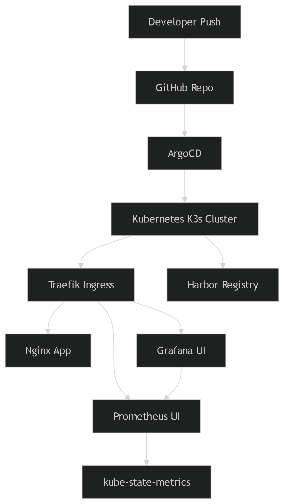
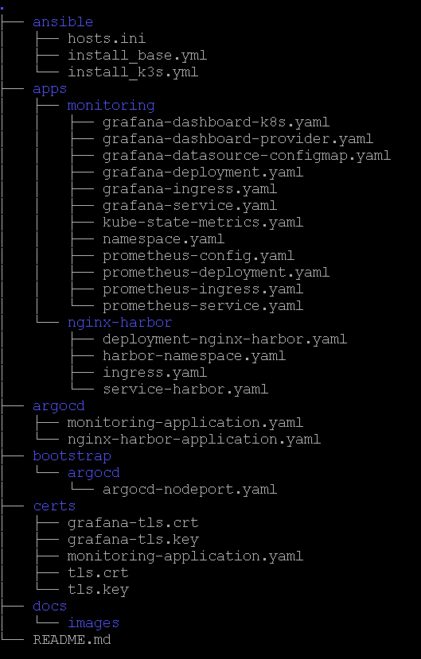

🚀 Platform GitOps Lab

---

🧠 Overview

Plataforma DevOps basada en GitOps + Observabilidad, desplegada sobre Kubernetes (K3s).

Incluye:

⚙️ Infraestructura automatizada (Ansible)<br>
🔁 GitOps con ArgoCD<br>
📦 Registry privado (Harbor)<br>
🌐 Ingress con Traefik + TLS<br>
📊 Observabilidad completa (Prometheus + Grafana)<br>
☸️ Métricas de Kubernetes (kube-state-metrics)<br>
🔎 Observabilidad inteligente con Coroot (eBPF)<br>

---

🏗️ Arquitectura


---

## 📁 Estructura del proyecto



---

⚙️ GitOps Workflow

Git push → ArgoCD detecta → Sync automático → Kubernetes aplica

✔ Declarativo
✔ Automatizado
✔ Sin intervención manual

---

📦 Aplicación de ejemplo

nginx-harbor
image: 192.168.1.24/platform/nginx:v1

Incluye:

Deployment
Service (ClusterIP)
Ingress (Traefik)
TLS self-signed

---

🌐 Accesos<br>

Servicio        URL<br>
Nginx   https://nginx.platform.local:31788<br>
Grafana https://grafana.platform.local:31788<br>
Prometheus      https://prometheus.platform.local:31788<br>
Coroot  https://coroot.platform.local:31788<br>

---

# 📊 Observabilidad

---

🔹 Prometheus<br>

Recolecta métricas de:<br>

Kubernetes<br>
kube-state-metrics<br>

---

🔹 kube-state-metrics<br>

Expone métricas como:<br>

kube_pod_info<br>
kube_deployment_status_replicas<br>
kube_node_info<br>

---

🔹 Grafana<br>

Datasource: Prometheus<br>
Dashboards gestionados por GitOps<br>
Provisioning automático vía ConfigMap<br>

---

📊 Dashboards<br>

Carga automática desde:<br>

/var/lib/grafana/dashboards<br>

Provider:<br>

/etc/grafana/provisioning/dashboards<br>

⚠️ Requiere restart del pod para aplicar cambios<br>

---

# 🔎 Observabilidad inteligente (Coroot)

Se incorpora **Coroot** como capa avanzada de observabilidad.

---

## 🚀 Características

* Auto-descubrimiento de servicios
* Observabilidad basada en eBPF
* Distributed tracing sin instrumentación
* Mapa de dependencias en tiempo real
* Detección automática de problemas
* Integración con Prometheus

---

## 🏗️ Componentes desplegados

Namespace: `coroot`

* coroot-operator
* coroot-coroot
* coroot-cluster-agent
* coroot-node-agent
* coroot-prometheus
* coroot-clickhouse

---

## 🌐 Acceso

```text
https://coroot.platform.local:31788
```

---

## 🔍 Validaciones Coroot

```bash
kubectl get applications -n argocd
kubectl get pods -n coroot
kubectl get svc -n coroot
kubectl get ingress -n coroot
curl -k https://coroot.platform.local:31788
```

---

## 🧪 Testing (generar tráfico)

```bash
while true; do
  curl -k https://nginx.platform.local:31788
  sleep 1
done
```

---

## 📊 Casos de uso

* Visualización de dependencias entre servicios
* Análisis de performance sin modificar código
* Detección de cuellos de botella
* Observabilidad moderna para microservicios

---

## ⚖️ Comparación

| Feature              | Prometheus + Grafana | Coroot |
| -------------------- | -------------------- | ------ |
| Métricas             | ✅                    | ✅      |
| Dashboards           | ✅                    | ✅      |
| Tracing              | ❌                    | ✅      |
| Auto-discovery       | ❌                    | ✅      |
| Detección automática | ❌                    | ✅      |

---

🔐 Seguridad<br>

TLS self-signed<br>

```bash
openssl req -x509 -nodes -days 365 -newkey rsa:2048 \
  -keyout tls.key \
  -out tls.crt \
  -subj "/CN=*.platform.local/O=platform-lab"
```

---

Harbor (HTTP)<br>

```bash
docker login 192.168.1.24
```

---

🔍 Validaciones<br>

```bash
kubectl get pods -A
kubectl get svc -A
kubectl get ingress -A
kubectl get applications -n argocd
```

---

🧪 Testing<br>

```bash
curl -k https://nginx.platform.local:31788
curl -k https://grafana.platform.local:31788
curl -k https://prometheus.platform.local:31788
curl -k https://coroot.platform.local:31788
```

---

🧠 Networking<br>

Internal: 192.168.58.x<br>
External: 192.168.1.x<br>

---

💡 Best Practices<br>

Git como fuente de verdad<br>
No versionar secretos<br>
Versionar imágenes (no latest)<br>
Namespaces por app<br>
Todo vía GitOps<br>

---

📌 Roadmap<br>

Node Exporter (infra metrics)<br>
Kubernetes Dashboard PRO<br>
Alertmanager<br>
Keycloak (SSO)<br>
cert-manager (TLS real)<br>
Vault / External Secrets<br>
Multi-env (dev / uat / prod)<br>
DNS real<br>
Coroot + análisis avanzado de performance<br>
Integración con Service Mesh (Istio)<br>

---

👨‍💻 Autor<br>

Rubinho<br>
DevOps • Kubernetes • Middleware<br>

